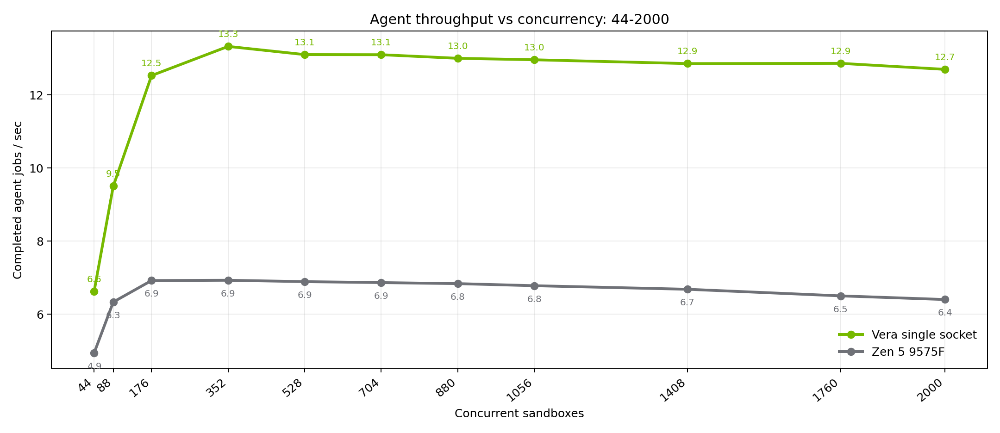
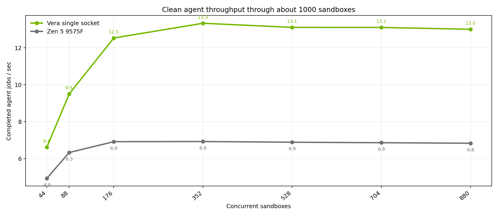

# Vera vs Zen 5 for packed agent sandboxes

September 2026

Daytona, NVIDIA Vera single socket vs AMD EPYC 9575F Zen 5

Daytona runs coding agents inside isolated sandboxes. Production nodes pack many of those sandboxes on one machine. The questions for us are simple:

1. How many agent jobs per second does the chip still deliver when the node is full?
2. How fast can we stand up a dense fleet when we need to?

We matched the same agent workload on a single Vera socket and on a Zen 5 9575F box, packing from tens of sandboxes up through two thousand.

## Throughput 44-2000

Across the full ladder, Vera stays about 1.9x ahead at peak throughput.

## Throughput through about 1000

On the clean band through about a thousand sandboxes, the story does not change.

## Create about 1000 sandboxes

This is a create-and-ready check: boot the agent image, run `echo ready`, and measure how long until that command succeeds across a thousand sandboxes in parallel.

## Create 2000 sandboxes

At two thousand sandboxes, Vera still completes the create-and-ready path cleanly.

## Takeaway

For dense agent tenancy on one socket, Vera sustains nearly 2x the agent job throughput of this Zen 5 SKU once the node is packed. On the narrower create-and-ready check, Vera is also much faster at a thousand sandboxes, and it remains clean at two thousand.
