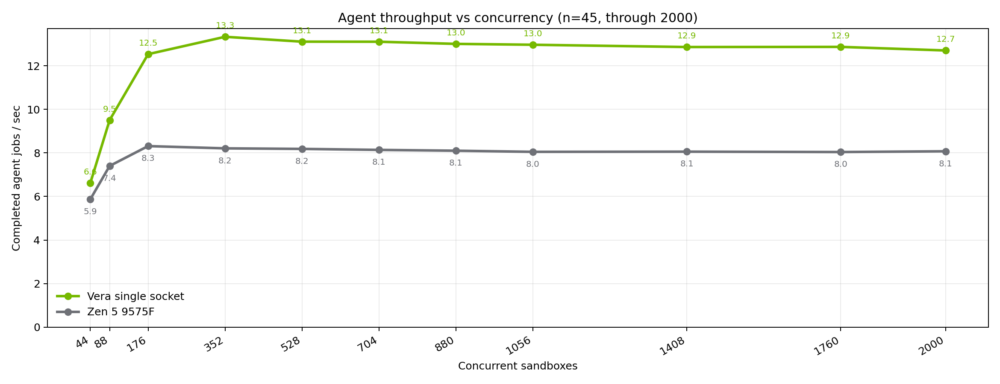
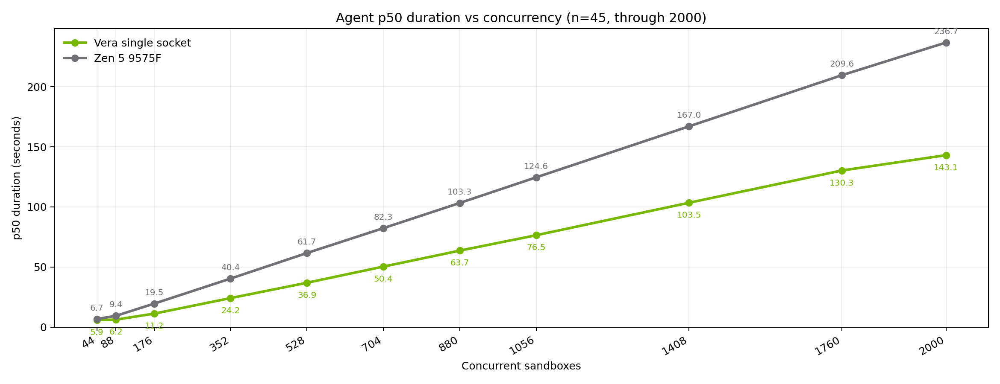
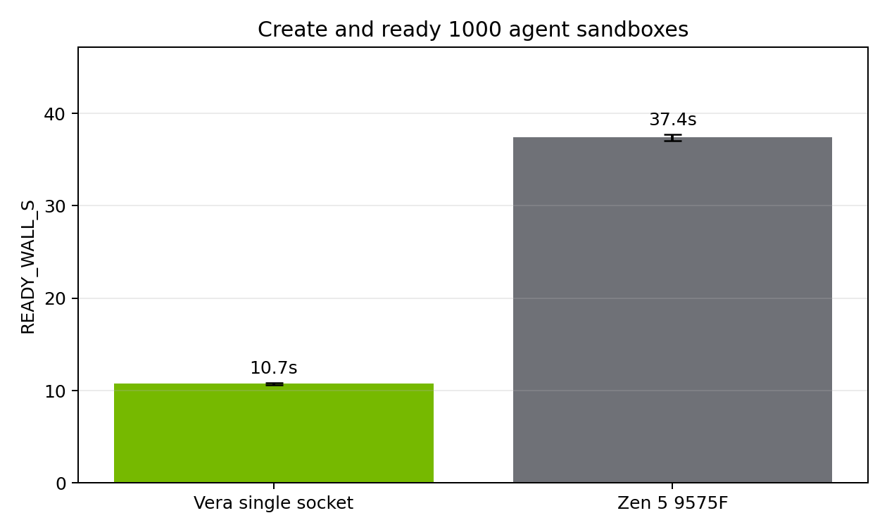
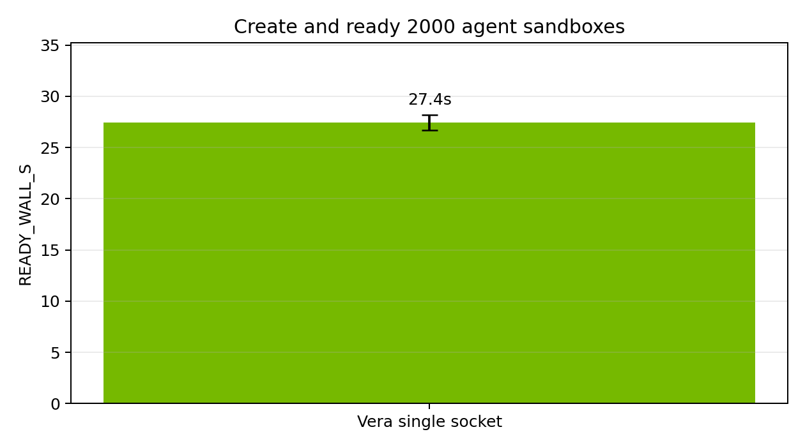

# Vera vs Zen 5 for packed agent sandboxes

September 2026  
Daytona · NVIDIA Vera vs AMD EPYC 9575F

Daytona runs coding agents inside isolated sandboxes. Production nodes pack many of those sandboxes on one machine. The questions for us are simple:

1. How many agent jobs per second does the chip still deliver when the node is full.
2. How fast can we stand up a dense fleet when we need to.

We matched the same agent workload on a single Vera socket and on a Zen 5 9575F box, packing from 44 sandboxes through 2000. The job is `n=45`: eight episodes per sandbox, building a small broken Python package, searching and parsing it, applying a patch, then running pytest. That is the same loop agents use on Daytona: search, apply, test, repeat. Zen 5 finished every rung through 2000 with zero failures. Vera was clean through 1760; its 2000 rung had a small number of failures.

## How we measured

Same agent image, same `n=45` coding loop, eight episodes per sandbox, hold-then-exec so create is not in the throughput number. Vera's host has two 88-core sockets; we pinned the Daytona runner and every sandbox to socket 0 (`cpuset` `0-87,176-263`, memory node 0) so this is a single socket comparison to Zen5. We confirmed the pin in btop: only that socket was loaded.

## Throughput 44–2000: Vera stays ~1.7× at peak

Vera's peak agent throughput is 13.3 jobs/s at 352 concurrent sandboxes against Zen 5's 8.0 jobs/s at the same level, about 1.7×. Averaged across the same concurrency levels, Vera stays about 1.5× Zen 5.

Once packed, the gap holds. Zen 5 plateaus just above 8 jobs/s after 176. Vera plateaus around 13 jobs/s after 352. At 2000 concurrent sandboxes Vera is still 1.6× Zen 5 (12.7 vs 8.1 jobs/s).

## Median duration: jobs get slower, the gap holds

p50 duration climbs with concurrency on both chips. Throughput stays flat because each job takes longer under load. At 2000, Vera's p50 is 143.1s vs Zen 5's 236.7s, about 1.7× faster. The duration ratio tracks the throughput ratio once the node is full.

## Create ~1000 sandboxes: how fast until a command runs

This is not a full customer agent workload. It is a create-and-ready check: boot the agent image, run `echo ready`, and measure how long until that command succeeds across a thousand sandboxes in parallel. That matters for cold start and burst admit. It does not measure pytest, coding loops, or sustained agent work. Those are what the throughput sections above cover.

Vera finishes that ready path in 10.7 ± 0.1 seconds (four runs, all 1000/1000). Zen 5 takes 37.4 ± 0.3 seconds (three repeats). About 3.5× faster on Vera.

## Create 2000 sandboxes: Vera finishes clean in about 27 s

At two thousand sandboxes Vera creates and proves ready in 27.4 ± 0.8 seconds (same agent image plus `echo ready`, three repeats, all 2000/2000 ok). That is faster than Zen 5's thousand-sandbox ready path: Vera can spin up 2000 sandboxes before Zen 5 finishes 1000 (27.4s vs 37.4s).

## What to take away

For dense agent tenancy on one socket, Vera's peak is about 1.7× the agent job throughput of this Zen 5 SKU, and it still holds about 1.6× at 2000 concurrent sandboxes. On the narrower create-and-ready check, Vera is also much faster: about 3.5× at a thousand sandboxes, and Vera can spin up 2000 before Zen 5 finishes 1000.
