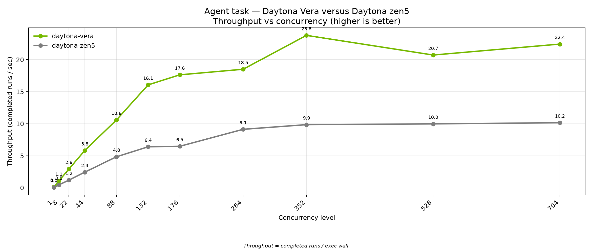
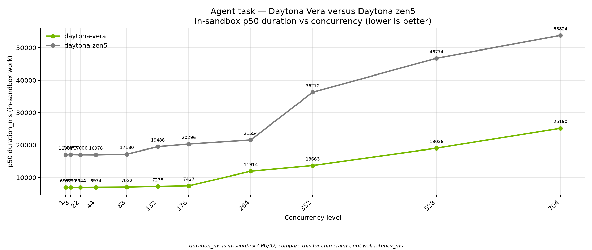

# Daytona Sandbox Compute: Chip Evaluation Summary

August 2026.

This brief summarizes how Daytona evaluates CPUs for isolated sandbox workloads. This covers what shape of tasks our customers run, what we measured on NVIDIA Vera, AMD EPYC Turin (Zen 5), and AWS Graviton5, and what that implies for future silicon choices.

## What to take away

Daytona's largest tenants spend CPU time inside sandboxes completing tasks that fall into the following buckets:

- Coding agents search, edit, and test code
- Eval suites build and verify trials
- Analytics jobs query local data
- Filesystem work for installs and artifacts
- Media pipelines transcode and transform inputs

GPU training sits outside this picture. Our question is how fast the **CPU-side environment** runs.

On those workloads, **NVIDIA Vera** is the strongest overall story for coding-agent work and multi-tenant density. **AMD Zen 5 (Turin)** wins on some vector-heavy paths (notably media transcode). **Graviton5** is a useful ARM64 reference but shows classic noisy-neighbor slowdown as tenancy rises. We ran a structured evaluation program with NVIDIA on Vera and added next-generation Vera CPU nodes into our production runner fleet during testing.

---

## Why CPU choice matters

For coding-agent reinforcement learning tenants, each sandbox episode is a burst of CPU and filesystem work. Those episodes compound and a few extra seconds per episode becomes thousands of worker-hours at post-training scale. Slow environments also leave attached GPU clusters waiting for rollout batches. This is the rollout infrastructure tax we studied across sandbox substrates ([arXiv:2607.01415](https://arxiv.org/abs/2607.01415)).

On our coding-agent workload, Vera completes a typical episode in about **7 seconds** versus about **17 seconds** on Zen 5. Projected across one million episodes, that gap is roughly **2,770 worker-hours** saved on Vera, before counting any GPU utilization reclaimed when rollouts arrive faster.

We measured these chips on representative workloads that match what customers frequently run. Specifically coding-agent sessions, eval packs, local analytics, filesystem-heavy sessions, and media preprocessing under rising concurrent tenancy.

---

## Customer workloads we care about

These five workloads are the spine of our compute requirements. Every chip comparison below maps back to one of them.

| # | What customers run | What it stresses on CPU | Why it matters economically |
|---|--------------------|-------------------------|------------------------------|
| 1 | **Coding-agent RL rollouts** | Python analysis, repo search/edit, test runs, filesystem I/O inside each sandbox episode | Episode time → worker-hours on rollout workers; faster CPU-side episodes mean less idle time on attached GPU clusters |
| 2 | **Agent evals** | Build, run, and verify trial packs | Time-to-finish eval suites at concurrency |
| 3 | **Analytics** | Parquet generation and SQL on in-sandbox data | Memory bandwidth under multi-tenant pack |
| 4 | **Filesystem work** | Installs, artifacts, many small files | Contention when many tenants share a node |
| 5 | **Media processing** | Transcode and transform pipelines | Bandwidth-heavy workloads adjacent to agent pipelines |

Coding-agent RL rollouts rank first because they dominate CPU spend for our largest tenants. The silicon question is how fast the sandbox environment runs when a large fleet of agents search, edit, test, and I/O in parallel. Much of the industry conversation centers on GPU capacity for policy training but we argue that training only matters if the CPU-side environment can execute agent work efficiently at scale. Slow sandboxes leave accelerators waiting and fast CPUs are what let rollouts keep pace with training.

---

## Chips we tested

| Platform | Silicon | Architecture | Scale tested |
|----------|---------|--------------|--------------|
| **Vera** | NVIDIA Olympus | aarch64 | Dual-socket cell, 176 physical cores |
| **Zen 5** | AMD EPYC Turin | x86_64 | 192 physical cores |
| **Graviton5** | AWS Graviton5 | aarch64 | Cloud ARM64 reference |

We ran matched workloads and concurrency levels on each platform. Headline comparisons focus on two questions: how long does each job take at low tenancy, and how many jobs finish per second when many sandboxes run together?

---

## Results: workload trade-offs

Headline numbers from our August 2026 evaluation runs. Per-job times are median time spent inside the sandbox doing the work. Throughput is completed jobs divided by wave wall time at the cited concurrency.

| Workload | Vera | Zen 5 | Graviton5 | Takeaway |
|----------|------|-------|-----------|----------|
| **1. Coding-agent** | ~10% faster at 1 vCPU idle; ~2.4× faster per episode under fractional CPU; ~23 jobs/s through thousands of concurrent sandboxes | Baseline x86; ~10 jobs/s plateau at high density | ~2× lower throughput at ~88 concurrent; per-job time climbs sharply under pack | Vera's strongest story: agent performance plus density |
| **2. Agent evals** | ~1.3 s per trial; ~39 trials/s at 88 concurrent | ~1.4 s per trial; ~42 trials/s at 88 concurrent | ~1.3 s per trial; ~16 trials/s at 88 concurrent | Similar per-trial chip time; Zen 5 packs short eval work fastest; Vera competitive |
| **3. Analytics** | ~19% faster idle; holds lead through 176 concurrent | Slower at every level tested | ~18% slower idle; more stretch under pack | Bandwidth-heavy tenant profile favors Vera |
| **4. Filesystem** | ~18-30% faster idle; flat per-job time through high concurrency (~34 jobs/s at 88) | Slower idle; flat chip time, lower packing | Severe slowdown under pack (~3.6 s at 88 vs ~0.4 s idle) | Per-core bandwidth and contention dominate |
| **5. Media** | ~15 s per encode idle; ~5 encodes/s at 88 concurrent | ~8.6 s per encode idle; faster transcode | ~18 s idle; ~4.4 encodes/s at 88 | Zen 5 leads encode speed; Vera ahead of Graviton5 |

*Supplementary note:* We also ran an internal NumPy-heavy CPU stress test (not a customer workload). Zen 5 leads Vera on that probe which is useful for silicon characterization but not a customer-facing claim.

### Coding-agent density story

Vera keeps completing more agent episodes per second as concurrency rises. Zen 5 plateaus near 10 jobs/s while Vera stays near 23 jobs/s through thousands of concurrent sandboxes.

*Charts below: Vera and Zen 5 results only.*

### Analytics and filesystem (Vera vs Zen 5)

Vera finishes analytics and local-disk work faster at single-sandbox and multi-tenant concurrency.

---

## Takeaways from our NVIDIA HQ on-site evaluation

Our structured onsite program with NVIDIA was built to mirror how our largest customers load production runners and what we had to learn to run Vera reliably at that scale.

### Testing at customer-scale concurrency

- We measured from a single sandbox through **hundreds and thousands of concurrent tenants per node**. That ladder matches how enterprise agent and eval customers pack runners today and where our density estimates are heading.
- Headline comparisons separate time spent *inside* the sandbox from platform overhead (create, schedule, network), so chip claims reflect in-guest work only.
- We ran matched workloads with verified identical work completion across chips. Early measurement artifacts (for example, client placement effects) were identified and corrected before publishing headline numbers.

### Production integration

- We added Vera nodes into our **production runner fleet** quickly which meant routing, multi-arch images, and ARM64 capacity paths.
- The onsite program produced partnership-grade evidence on next-generation ARM64 silicon while proving we can adopt new chips on the path customers already use.

### Platform tuning lessons

Running new silicon at density surfaced in-depth debugging work we would need on next-gen chips to get the performance we are looking for:

- **SMT and core topology tracing**: understanding when hyperthreading and core packing help or hurt agent workloads under burst fractional CPU.
- **NUMA placement**: pinning runners and memory for bandwidth-sensitive filesystem and analytics paths.
- **Remote memory controls**: tuning how guest memory is provisioned and accessed on dual-socket cells.
- **Firecracker optimization per chipset**: adapting our microVM layer to Vera's core model, I/O path, and isolation behavior rather than assuming one Firecracker config fits all CPUs.

These lessons are as important as raw benchmark numbers: they are what let us hold per-job time flat as tenancy climbs on a new architecture.

---

## Future CPU interests

The following is directional guidance for data center and silicon conversations on what would move Daytona customer bottom line if a partner can influence chip design or early access.

### Core: what moves our customers

1. **Single-thread and burst performance on agent-shaped work**: mixed Python, filesystem, and test execution; the dominant cost for coding-agent tenants today.
2. **Memory bandwidth per core**: keeps disk and analytics jobs flat as tenancy rises; Vera/Olympus is the positive reference on bandwidth-heavy paths.
3. **Multi-tenant density without noisy-neighbor degradation**: stable per-job time from one sandbox through 88+ concurrent tenants per node. Graviton5's contention climb under pack is the anti-pattern.
4. **Sufficient core count** for hundreds of concurrent 1-vCPU sandboxes or thousands of fractional-CPU tenants per node.

### Architecture direction: ARM64 and x86

5. We have seen **strong results on ARM64** (Vera, Graviton5) on core agent and density workloads, enough to treat ARM64 as a serious production path.
6. We are also invested in **x86** (Zen 5 Turin) where it wins on specific workloads. A chip runs one ISA or the other and we plan capacity across both and recognize the tradeoffs each offers. Vera on agent density and bandwidth-heavy work, Zen 5 on media transcode and some vector paths, Graviton5 as the cloud ARM64 baseline.
7. Workload-specific gaps remain on media and some vector paths where x86 still leads. A future chip that closes those without losing agent, filesystem, and analytics wins would be especially valuable.

### How we would evaluate a new chip

- Faster per-episode completion on coding-agent and eval workloads at low tenancy
- Higher completed jobs per second at 88+ concurrent sandboxes
- Flat per-job time as concurrency increases
- Low failure rate under density

---

## Appendix

### Summary table (August 2026)

| Workload | Vera (headline) | Zen 5 (headline) | Graviton5 (headline) |
|----------|-----------------|------------------|----------------------|
| Coding-agent | ~7 s / episode idle; ~23 jobs/s high density | ~17 s / episode idle; ~10 jobs/s plateau | ~2× lower throughput at ~88 concurrent |
| Agent evals | ~1.3 s trial; ~39 trials/s at 88 | ~1.4 s trial; ~42 trials/s at 88 | ~1.3 s trial; ~16 trials/s at 88 |
| Analytics | ~19% faster; holds through 176 | Slower at all levels | ~18% slower idle |
| Filesystem | ~18-30% faster; flat under pack | Slower; lower packing | Severe slowdown under pack |
| Media | ~15 s encode; ~5/s at 88 | ~8.6 s encode; faster chip | ~18 s encode; ~4.4/s at 88 |

### Data provenance

Results from controlled August 2026 evaluation runs on NVIDIA Vera (Olympus), AMD EPYC Turin (Zen 5), and AWS Graviton5 under matched workload configurations, collected during our structured partnership evaluation program with NVIDIA.

### Figures

1. Coding-agent throughput vs concurrency
2. Coding-agent per-episode time vs concurrency
3. Analytics time per job (Vera vs Zen 5)
4. Local disk time per job (Vera vs Zen 5)
