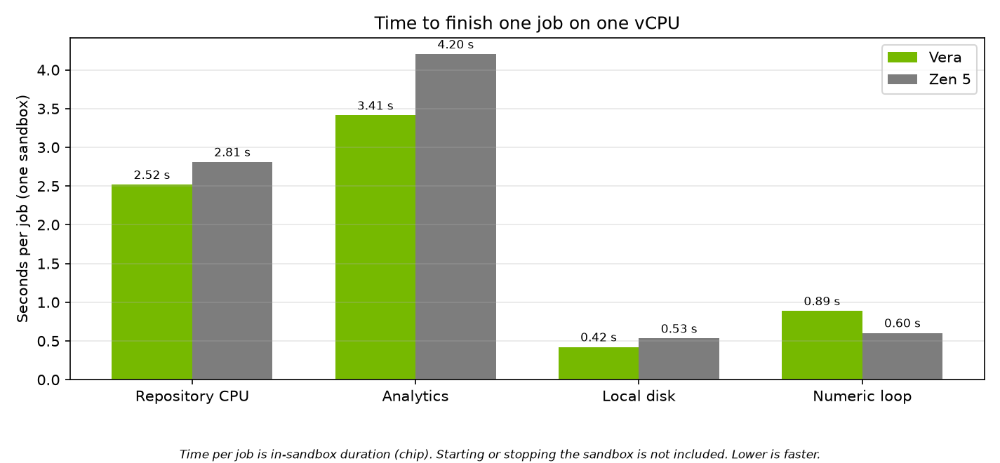
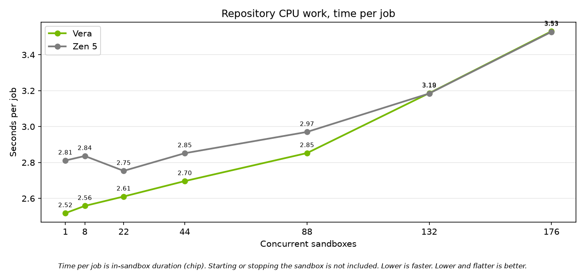
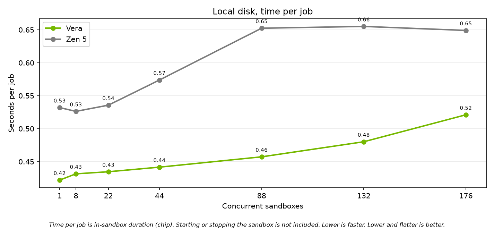
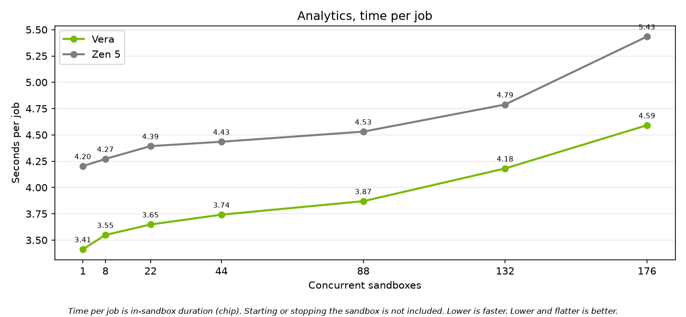
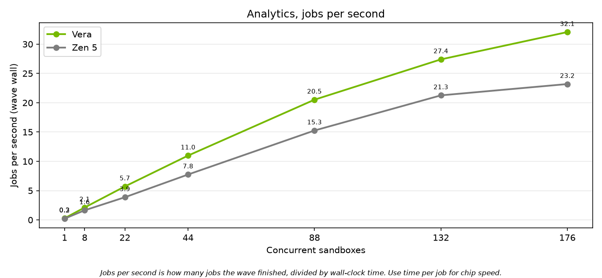
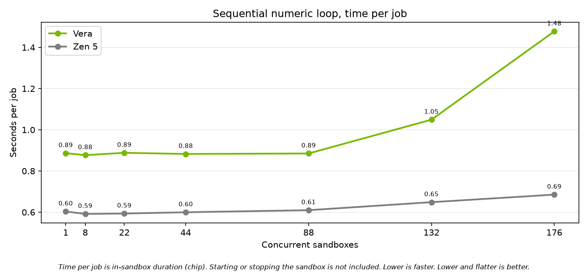
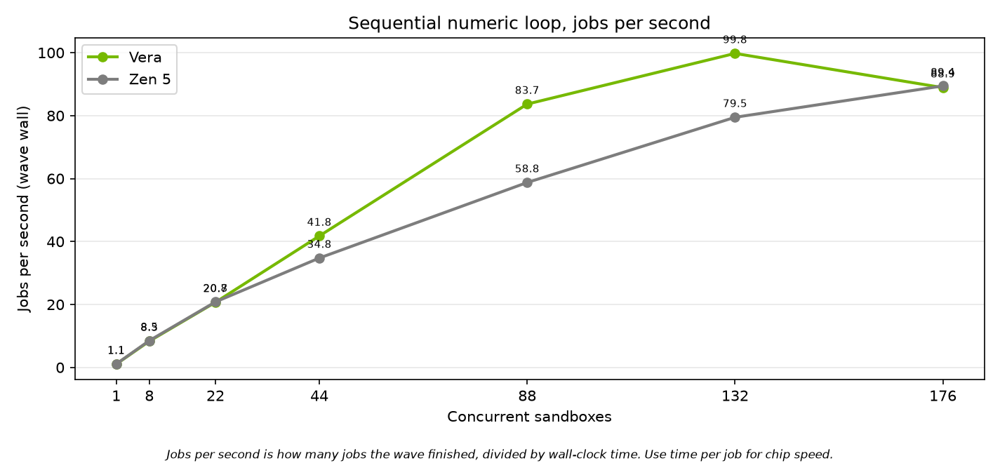

# NVIDIA Vera compared with AMD EPYC Zen 5

Isolated 1-vCPU sandbox results. August 2026.

This brief reports CPU and local-disk results from the same sandbox jobs running on NVIDIA Vera and on AMD EPYC processors with Zen 5 cores. Each job ran in its own sandbox with **1 vCPU** and **1 GiB of memory**. The goal was to see where Vera is faster on a single core, and where the chip holds up when many sandboxes run at the same time.

## What to take away

On a single sandbox, Vera finished repository CPU work about **10% faster**, analytics work about **19% faster**, and local disk work about **21% faster**. One sandbox is the fair chip compare. On the sequential numeric job, time per job is currently shorter on Zen 5. That job is stresses cache-bandwidth work rather than vector-units and we treat the gap as something to work through with NVIDIA.

At high concurrency, two numbers matter

- How long does each sandbox job take?
- How many of those jobs finish each second?

Vera kept disk and analytics jobs shorter through 176 concurrent sandboxes. On the coding-agent job, Vera held the lead through 88 sandboxes; at 176 the mean times meet, and Vera’s median is still shorter.

Vera can keep adding concurrent sandboxes on the numeric job instead of stalling around 132 to 176. That earlier stall seen around 88+ concurrent sandboxes was an SSH tunnel cap that we discovered.

Vera holds a flat in-guest time through **88** concurrent 1-vCPU sandboxes. At **176**, this dual-socket box is full: 176 sandboxes on 176 physical cores. Time per job stretching there is expected on a fully driven machine. It is not a defect at 88 cores, and it is not one socket filling before the other.

Lower bars are faster. On the numeric loop we still see room to get more out of Vera.

## How to read the numbers

**Time per job** is the time spent inside the sandbox doing the work. It does not include starting or stopping the sandbox.

**Jobs per second** is how many sandbox jobs the wave finished, divided by the wall-clock time of that wave. That is the packing number: how many isolated sandboxes the platform can keep busy at once.

We stepped through 1, 8, 22, 44, 88, 132, and 176 sandboxes.

Every quoted wave below finished with **zero failed jobs**. Both chips ran the same work, the same seed, and the same work size. Each successful job produced a matching checksum, so the two sides completed the same work.

## How the experiment ran

Jobs ran on Daytona sandboxes. Vera sandboxes were placed on the Vera cell (one dual-socket machine, **176** physical cores). Zen 5 sandboxes were placed on the Phoenix cell (`us-phoenix-1`, one AMD EPYC family 26 / Turin machine, **192** physical cores). Both sides used 1 vCPU and 1 GiB of RAM per sandbox. The guest on Vera is Linux 6.12 on aarch64. The guest on Zen 5 is Linux 6.8 on x86_64.

For each task, a new sandbox was provisioned. For some tasks, we repeated the job — the same code and program — to simulate a longer-running horizon, the kind of long-running agentic work we see in our customer base. That was to get a better idea of how the Vera chip performed under longer, realistic workloads, rather than quick Python compilations.

Early high-concurrency runs from a laptop went through an SSH local tunnel that connected through Daytona to the Vera node. That was necessary because of network firewall restrictions, and it was the most realistic way for us to add the Vera node to the existing Daytona fleet of runners — to test how it would perform as if we already had Vera running in product, compared with running everything locally in Docker containers. That tunnel had a connection cap, so jobs per second looked like they collapsed around 132 to 176 concurrent sandboxes even while time inside the sandbox stayed flat. To fix this, we reran directly on the Vera node so the client sat next to the sandboxes and avoided the capped SSH tunnel, while still staying close to a production setup. 

## Repository CPU work

This job searches, parses, edits, and tests a local codebase, then runs a small SQL step. That is the same loop a coding agent runs inside a Daytona sandbox: find code, read it, change it, and check that the change works. Scale factor 200. Each sandbox ran eight jobs.

On one sandbox, Vera took **2.52 seconds**. Zen 5 took **2.81 seconds**. That is about 10% faster on Vera.

Vera stayed faster through 88 concurrent sandboxes (**2.85 seconds** versus **2.97 seconds**). At 132 and 176 the mean times meet (about **3.19 seconds** and **3.53 seconds** on both chips). Vera’s median at 176 is still shorter: **3.27 seconds** versus **3.55 seconds**.

**Headline finding:** Vera is about 10% faster on this coding-agent CPU job at one vCPU, and it holds that lead through 88 isolated sandboxes. At 176 concurrent sandboxes the averages meet; Vera’s typical job is still shorter.

**What we want to look at with NVIDIA.** Time per job on Vera stayed near 2.5–2.9 seconds through 88 sandboxes, then rose at 132 and 176. We have already ruled out a first-socket wall at 88, and the SSH tunnel as the cause of this in-sandbox rise. At 176, Vera is a fully driven 176-core box; stretching there is expected. We would still like to work with NVIDIA on the rise between 88 and 176 (client on the same node, frequency, housekeeping) so we get the full performance of the Vera chip on this agent loop.

## Local disk

Coding agents on Daytona spend a lot of time on the sandbox filesystem: copying a project, writing files, installing packages, and producing build or test artifacts. This job is a sequential write plus many small files on that local disk. It is meant to stand in for that part of a real Daytona session. Scale factor 128. One job per sandbox.

Vera took **0.42 seconds** on one sandbox. Zen 5 took **0.53 seconds**. That is about 21% faster on Vera. The gap held through 176 sandboxes (**0.52 seconds** versus **0.65 seconds**). Time per job on Vera moved only from **0.42 seconds** to **0.52 seconds**.

**Headline finding:** Vera finishes this local-disk work about 18% to 30% faster than Zen 5, from one sandbox through 176.

**Jobs per second on this chart.** Vera keeps adding concurrent sandboxes through 176 while time per job stays nearly flat. That is the packing picture we care about: more isolated sandboxes, still finishing the same disk work. We looked at the Vera / Olympus core to understand why this holds against Zen 5. Olympus is built for about **3× the memory bandwidth per core**, and that is our main read on these curves: this job keeps moving data as we pack the box, so the extra per-core bandwidth shows up as flat time per job and rising jobs per second, instead of the stretch we would expect if each core were bandwidth-starved. 

## Analytics

Daytona sandboxes are also used for local data work: generate tables, write them to disk, and query them in the same machine, without a remote warehouse. This job does that path with Parquet and DuckDB (generate, write, join, filter, aggregate). Scale factor 200. Each sandbox ran eight jobs.

On one sandbox, Vera took **3.41 seconds**. Zen 5 took **4.20 seconds**. That is about 19% faster on Vera. Vera stayed faster at every concurrency, including 176 (**4.59 seconds** versus **5.43 seconds**).

**Headline finding:** Vera is faster on this Parquet and SQL job at every concurrency we measured, from one sandbox through 176.

**Jobs per second.** Vera completed more jobs per second (about **21/s** at 88 and **32/s** at 176). That is more concurrent analytics sandboxes finishing the same Parquet and SQL work. This job moves a lot of table data through memory; the same Olympus **3× memory bandwidth per core** is our read on why Vera stays ahead here as concurrency climbs.

## Sequential numeric loop

This job runs 5,000 sequential steps. Each step does small matrix multiplies and an environment update. Steps inside one job cannot run in parallel. Each sandbox ran eight jobs. On the first chart, **lower and flatter is better**: the job is not slowing down as more sandboxes are added.

This job currently takes **0.89 seconds** on Vera and **0.60 seconds** on the Zen 5. The heavy step is a batch of eight against a 384×384 float64 weight matrix: about **1.2 MB** of weights for **2.4 million** operations, or roughly **two operations per byte**. That is eight matrix-vector products, bound by cache bandwidth, not by vector-pipe throughput. Wider SVE2 or AVX-512 barely helps while the core is waiting on L2. What shows up is clock and how the math library handles these small kernels. Even a fully SVE-tuned math library would likely close only part of this 1.5× gap. A float32 version (half the bytes) or a much larger batch (compute-bound) would be a better test of Vera’s vector units. (Planned run)

Vera stayed near **0.88 seconds** through 88 concurrent sandboxes. Throughput climbed to **84 jobs per second** at 88 and **100** at 132. At 176, time per job is **1.48 seconds**. That wave was driven on the Vera node: about 176 jobs actually in flight on 176 physical cores, so sharing and sandbox housekeeping start there. That stretch is expected on a full box.

We hypothesize that Zen 5 is benefiting from higher clocks and a stronger path through these tiny float64 matmuls, which is why each episode finishes faster (~0.60 s) even while Vera packs more of them at once.

Earlier laptop runs through the SSH tunnel flattened near 50 jobs per second. That was the tunnel, not the chip.

**Headline finding:** On one sandbox this numeric job is slower on Vera today because it is cache-bandwidth work, not a vector-unit burn. Once we left the SSH tunnel, Vera packed it to 84 jobs per second at 88 sandboxes and 100 at 132, with time per job flat through 88. The rise at 176 is a full 176-core box, not a chip problem.

**What we want to look at with NVIDIA.** The idle gap is the chip question. Switching this job to float32 or a much larger batch should raise arithmetic intensity and tell us how much of the 1.5× is kernel fit versus clock and cache bandwidth. We do not expect “just enable SVE kernels” to close all of it. Separately, we want a quiet-window look at clocks and SVE versus scalar counters on a single pinned episode. We would like to work through that with NVIDIA so we are getting the full performance of the Vera chip.

## Four sentence summary

- **Single-core CPU and disk.** On a single vCPU, Vera finished mixed CPU work about 10% faster than Zen 5, analytics about 19% faster, and local disk work about 21% faster.
- **Scaling disk, analytics, and agent.** Vera’s disk and analytics times stayed shorter from 1 to 176 isolated sandboxes. On the coding-agent job Vera led through 88; at 176 the averages meet and Vera’s median is still shorter.
- **Numeric jobs.** One sandbox is the chip compare (0.89 s on Vera today). That job is cache-bandwidth bound; extra vector width is not the lever. Vera packs it to 84 jobs per second at 88 sandboxes and 100 at 132. The 176 stretch is a full box, not a chip defect.
- **Not an 88-core socket cliff.** Flattening jobs per second at 132–176 in the first Vera runs was an SSH local tunnel cap. In-sandbox time does not fall over at 88.

## Method notes

Numbers are mean time inside the sandbox, in seconds, unless the text says jobs per second or median. Jobs per second uses the wave wall clock.

Checksums matched on every 0-fail wave we quote.

Caveats: both cells in this brief are one machine. Vera has 176 physical cores; the Zen 5 box has 192. `/proc/cpuinfo` on this arm64 box has no MHz field. Vera is a shared vendor box; some run-to-run noise is other tenants.

Source files:

- Repository CPU, Vera: `data/agent/rlp-vera/concurrency_20260821_161503_n200.jsonl`
- Repository CPU, Zen 5: `data/agent/rlp-phoenix/concurrency_20260821_164629_n200.jsonl`
- Disk, Vera: `data/disk/rlp-vera/concurrency_20260821_162121_n128.jsonl`
- Disk, Zen 5: `data/disk/rlp-phoenix/concurrency_20260821_165436_n128.jsonl`
- Analytics, Vera: `data/analytics/rlp-vera/concurrency_20260821_162249_n200.jsonl`
- Analytics, Zen 5: `data/analytics/rlp-phoenix/concurrency_20260821_171146_n200.jsonl`
- Numeric, Vera: `data/rl/rlp-vera/concurrency_20260821_154514_n5000.jsonl`
- Numeric, Zen 5: `data/rl/rlp-phoenix/concurrency_20260821_163715_n5000.jsonl`

Charts in this brief were drawn from those files only. They are in `eda_output/nvidia-brief/`.