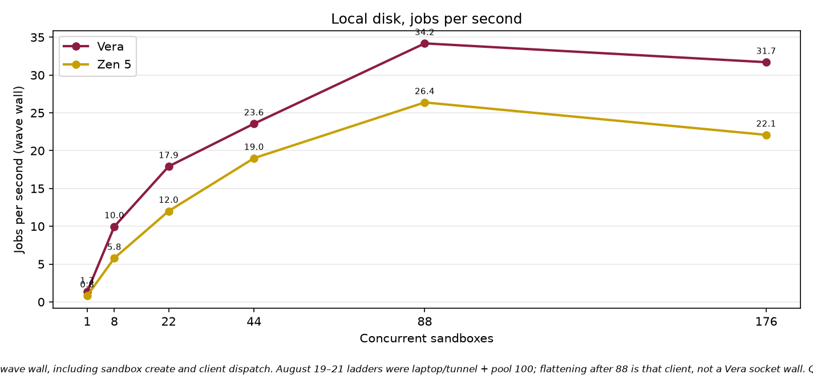

# NVIDIA Vera compared with AMD EPYC Zen 5

Isolated 1-vCPU sandbox results. August 2026.

This brief reports CPU and local-disk results from the same containerized jobs running on NVIDIA Vera and on AMD EPYC processors with Zen 5 cores. Each job ran in its own sandbox with **1 vCPU** and **1 GiB of memory**. The goal was to see where Vera is faster on a single core, and where the chip holds up when many sandboxes run at the same time.

## What to take away

On a single sandbox, Vera finished repository CPU work about **10% faster**, analytics work about **28% faster**, and local disk work about **40% faster**. Zen 5 finished a single sequential numeric job faster.

When many sandboxes run at once, **use time inside the sandbox** to talk about the chip. Vera kept disk and analytics jobs shorter through 176 concurrent sandboxes. On the sequential numeric job, Vera stayed near **1 second** per job at 176 concurrent sandboxes. Zen 5 slowed to about **3.7 seconds**.

Vera’s silicon holds a flat in-guest p50 through at least **132** truly concurrent busy guests. Real core sharing on this dual-socket **176-core** box starts at about 176 concurrent 1-vCPU sandboxes, and it shows up in the tail first. That is expected. It is not a defect at 88 cores, and it is not one socket filling before the other.

Lower bars are faster. The numeric loop on the right is the exception: Zen 5 wins that single-job comparison.

## How to read the numbers

**Time per job** is the time spent inside the sandbox doing the work. Use this number for chip speed. It does not include starting or stopping the sandbox.

**Jobs per second** on the August 19–21 ladders is how many jobs the wave finished, divided by the wall-clock time of that wave. That includes sandbox create time **and** the benchmark client. The client used a 100-connection pool. Vera runs were driven through an SSH tunnel from a laptop. Those jobs-per-second curves flatten after 88 while in-sandbox time stays flat — that is the client and create storms, not the chip running out of cores. Do not use those jobs-per-second figures as silicon packing.

A **sandbox** here is a lightweight virtual machine. Concurrency is the number of those machines running the same job at the same time. We stepped through 1, 8, 22, 44, 88, and 176 sandboxes. The numeric tests also ran 352.

Every quoted wave below finished with **zero failed jobs**, except where a caption says otherwise. Both chips ran the same image, the same seed, and the same work size. Each successful job produced a matching checksum, so the two sides completed the same work.

## How the experiment ran

Jobs ran on Daytona sandboxes. Vera sandboxes were placed on the Vera cell. Zen 5 sandboxes were placed on the Phoenix cell (`us-phoenix-1`, AMD EPYC family 26 / Turin). Both sides used 1 vCPU and 1 GiB of RAM per sandbox. The guest on Vera is Linux 6.12 on aarch64. The guest on Zen 5 is Linux 6.8 on x86_64.

Most tests reused each sandbox for eight jobs after it started. That keeps create time out of the per-job chip number. Disk tests started a new sandbox for every job.

We did not compare Docker containers packed onto one host. We did not compare fractional CPU shares. Those are different products. This document is 1 vCPU versus 1 vCPU.

## Repository CPU work

This job searches, parses, edits, and tests a local codebase, then runs a small SQL step. That is the same loop a coding agent runs inside a Daytona sandbox: find code, read it, change it, and check that the change works. Scale factor 200. Each sandbox ran eight jobs.

On one sandbox, Vera took **2.53 seconds**. Zen 5 took **2.82 seconds**. That is about 10% faster on Vera. The same gap showed up when we ran one job per sandbox instead of eight.

Vera stayed faster through 88 concurrent sandboxes.

**Headline finding:** Vera is about 10% faster on this coding-agent CPU job at one vCPU, and it holds that lead through 88 isolated sandboxes.

**At 176 concurrent sandboxes.** In-sandbox time on this ladder rose from **2.80 seconds** at 88 to **4.32 seconds** at 176. Checksums still matched. That rise is inside the guest clock, so it is not only create time — but this wave still mixed sandbox create and delete with running jobs. Linux does not fill socket 0’s 88 cores first; a fixed in-guest spin on this box stays flat through 132 concurrent busy guests, and core sharing begins at the physical core count (176). We are not treating the 176 coding-agent number as a closed chip comparison until we rerun with a pre-created fleet (hold, then exec) from a client next to the cell.

## Local disk

Coding agents on Daytona spend a lot of time on the sandbox filesystem: copying a project, writing files, installing packages, and producing build or test artifacts. This job is a sequential write plus many small files on that local disk. It is meant to stand in for that part of a real Daytona session. Scale factor 128. One job per sandbox.

Vera took **0.43 seconds** on one sandbox. Zen 5 took **0.71 seconds**. That is about 40% faster on Vera. The gap stayed in the mid-30% range through 176 sandboxes. Time per job on Vera barely moved as concurrency rose (**0.43 seconds** to **0.44 seconds**).

**Headline finding:** Vera finishes this local-disk work about 35% to 40% faster than Zen 5, from one sandbox through 176.

**Jobs per second on this chart.** The line peaks at 88 (**34.2** jobs per second on Vera) and is lower at 176 (**31.7**). In-sandbox time did not get slower. These disk tests create a new sandbox for every job, so jobs per second includes a boot storm plus the client pool. That is why the packing line does not keep climbing. It is not evidence that the disk job, or the Vera cores, fell over at 88.

## Analytics

Daytona sandboxes are also used for local data work: generate tables, write them to disk, and query them in the same machine, without a remote warehouse. This job does that path with Parquet and DuckDB (generate, write, join, filter, aggregate). Scale factor 200. Each sandbox ran eight jobs.

On one sandbox, Vera took **3.39 seconds**. Zen 5 took **4.68 seconds**. Vera stayed faster at every concurrency, including 176 (**4.42 seconds** versus **5.08 seconds**).

At 88 sandboxes, Vera also finished more jobs per second: **18.3** versus **15.6**, about 18% more. At 176, jobs per second fell on both sides and landed in a tie (**14.4** versus **14.0**). Time per job was not a tie. Vera was still shorter.

**Headline finding:** Vera is faster on this Parquet and SQL job at every concurrency we measured. At 88 sandboxes it also completes more jobs per second.

**Jobs per second at 176.** The drop from 18.3 to 14.4 happened while in-sandbox time only moved from **3.93 seconds** to **4.42 seconds**. The wave wall grew faster than the chip time. Zen 5 shows the same shape. That is the same create-plus-client limit as the disk and numeric ladders, not a memory-bandwidth cliff at 88.

## Sequential numeric loop

This job runs 5,000 sequential steps. Each step does small matrix multiplies and an environment update. Steps inside one job cannot run in parallel. Each sandbox ran eight jobs. On the first chart, **lower and flatter is better**: the job is not slowing down as more sandboxes are added.

Zen 5 is faster when only a few sandboxes are running. One job: **0.50 seconds** on Zen 5, **0.88 seconds** on Vera. That lead holds through 88 sandboxes.

At 176 sandboxes the picture flips. Vera stayed near **0.98 seconds**. Zen 5 slowed to **3.70 seconds**.

At 352 sandboxes, Vera still finished in **0.97 seconds**, **zero failures**, and 2,816 completed jobs.

On this Vera ladder, p50 in-sandbox time rose only about **6%** through 352. The slow episodes (longer than 1.2 seconds) went from 0.6% of the wave at 44 sandboxes to 6.5% at 176. Those slow jobs were spread across all episode indices, which matches create and delete work overlapping running guests, not a first-socket wall.

**Headline finding:** Zen 5 is faster on a single numeric job. When 176 isolated 1-vCPU sandboxes run at once, Vera keeps job time near 1 second while Zen 5 slows to 3.7 seconds. At 352 concurrent sandboxes Vera still finished in 0.97 seconds with no failures.

**Jobs per second on this chart.** Vera went from 51.2 jobs per second at 88 to 53.1 at 176 while in-sandbox p50 stayed about 900 milliseconds. If the host were saturating, p50 would have climbed with the lost throughput. It did not. The 100-connection client pool, plus tunnel RTT on Vera, capped dispatch. On a held 176-sandbox fleet of the same ~1.1 second episodes, a client next to the cell measured **82.3 jobs per second** at pool 100 and **128.9 jobs per second** at pool 600, with guest p50 unchanged. Those are the platform numbers. The 53/s line in the chart is not.

## Where Zen 5 is ahead

- **One sequential numeric job:** 0.50 s on Zen 5 vs 0.88 s on Vera.
- **Short terminal-style evals:** about 1.32 s on Zen 5 vs 1.49 s on Vera.

We are not sending a packing winner on the coding-agent job at 176 concurrent sandboxes until the hold-then-exec ladder is rerun from a co-located client.

## Four sentence summary

- **Single-core CPU and disk.** On a single vCPU, Vera finished mixed CPU work about 10% faster than Zen 5, and local disk work about 40% faster.
- **Scaling disk and analytics.** Vera’s disk and analytics times stayed shorter as we scaled from 1 to 176 isolated sandboxes.
- **High-concurrency numeric jobs.** At 176 concurrent numeric jobs, Vera stayed near 1 second per job while Zen 5 slowed to 3.7 seconds.
- **Not uniform, and not an 88-core socket cliff.** Zen 5 leads on a single numeric job. Vera’s in-guest p50 stays flat well past 88. Jobs-per-second flattening after 88 on these ladders measured the client and boot storms, not Vera filling one socket.

## Method notes

Numbers are mean time inside the sandbox, in seconds, unless the text says jobs per second. Jobs per second uses the full wave wall clock, including sandbox create, unless we say the figure came from a held fleet.

Both cells used the same container images from Docker Hub. Checksums matched on every 0-fail wave we quote.

The August ladders used the SDK default 100-connection pool. Vera was driven through an SSH tunnel. A later held-fleet test showed those jobs-per-second plateaus were the client. The harness now widens the pool to 512, tempers create-status polling, and can pre-create the fleet (`--hold-then-exec`). Chip packing jobs/s should be taken from that protocol, run next to the cell (rlp-control for Vera, the Phoenix API host for Zen 5).

Caveats: `/proc/cpuinfo` on this arm64 box has no MHz field, so frequency scaling at 176 concurrent guests is unmeasured. Vera is a shared vendor box; some run-to-run noise is other tenants.

Source files:

- Repository CPU, Vera: `data/agent/rlp-vera/concurrency_20260821_030511_n200.jsonl`
- Repository CPU, Zen 5: `data/agent/rlp-phoenix/concurrency_20260821_030926_n200.jsonl`
- Disk, Vera: `data/disk/rlp-vera/concurrency_20260819_202521_n128.jsonl`
- Disk, Zen 5: `data/disk/rlp-phoenix/concurrency_20260820_204117_n128.jsonl`
- Analytics, Vera: `data/analytics/rlp-vera/concurrency_20260819_222014_n200.jsonl`
- Analytics, Zen 5: `data/analytics/rlp-phoenix/concurrency_20260820_201308_n200.jsonl`
- Numeric, Vera: `data/rl/rlp-vera/concurrency_20260819_190856_n5000.jsonl`
- Numeric, Zen 5: `data/rl/rlp-phoenix/concurrency_20260820_195139_n5000.jsonl`

Charts in this brief were drawn from those files only. They are in `eda_output/nvidia-brief/`.
