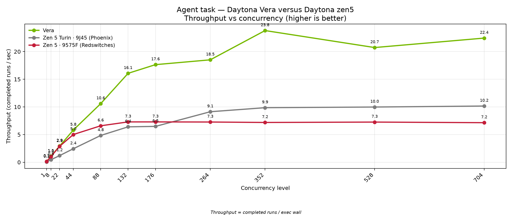
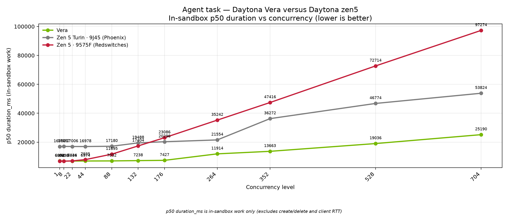

# Agent task: Daytona Vera versus Daytona zen5

August 2026. Coding-agent sandbox results on NVIDIA Vera and AMD EPYC Zen 5 (Phoenix and Redswitches).

This brief covers one workload: the **agent task** Daytona uses to stand in for coding-agent sessions inside isolated sandboxes. Both chips ran the same image, the same seed, and the same concurrency ladder.

## What to take away

On a single sandbox, Vera finished the agent loop in about **7.0 seconds** median. Phoenix (Turin **9J45**) took about **17.0 seconds**. Redswitches (**9575F**) took about **6.9 seconds** — essentially tied with Vera at concurrency 1, and much faster than the core-count Phoenix SKU on per-episode chip time.

As concurrency climbs through **704**, Vera keeps packing more completed jobs per second. Throughput reaches about **23.8 jobs/s** at 352 concurrent sandboxes and stays near **22 jobs/s** at 704 on Vera. Phoenix (9J45) plateaus near **10 jobs/s** through 704. Redswitches (9575F) plateaus near **7 jobs/s** — about **3×** lower aggregate throughput than Vera at the same rungs (and roughly **1.4×** below Phoenix, reflecting the smaller 9575F machine’s thread count). In-sandbox median time stays shorter on Vera than on both Zen 5 cells at every level we measured on this ladder.





Charts plot **three** cells: Vera, Phoenix (**Turin 9J45**, high core-count), and Redswitches (**9575F**, high-frequency Zen 5). Headline table below uses Phoenix as the primary Zen5 series (1 GiB ladder).

## Why this matters for Daytona (coding-agent RL)

Daytona's product story is not only "faster sandboxes." It is that **coding-agent reinforcement learning turns sandboxes into part of the training loop**. Agents inspect repos, edit code, run commands, and re-test inside isolated environments; those rollouts feed policy / reward training on expensive accelerators. When the CPU-side environment is slow to start or slow to finish, **GPU trainers wait** — the classic RL "starve the cluster" failure mode.

We measured that **rollout infrastructure tax** in a companion study comparing four execution substrates (single containers, hosted sandboxes, Kubernetes-orchestrated containers, and cloud VMs) under the same coding-agent workloads ([arXiv:2607.01415](https://arxiv.org/abs/2607.01415), _The Rollout Infrastructure Tax in Coding-Agent Reinforcement Learning_, SoCC 2026 submission). Headline results from that paper:

- Cold-start latency varied by up to **110×** across substrates.
- For **one million** 150-step trajectories, substrate choice produced a **1.8×** spread in projected rollout worker-hours — about **5,316 extra worker-hours** between the slowest and fastest substrate (42.5 s vs 23.4 s per trajectory).
- Even **1 second** of extra overhead per rollout is **278 worker-hours** at one million trajectories; **100 ms** per action across 150 steps is **4,167 worker-hours**.

Those numbers compare sandbox substrates. This brief asks the next question: once you are on Daytona, how much faster is Vera than Zen5 for each coding-agent episode?

### Example: Vera's chip gain at RL scale

On this agent task, Vera completes an idle episode in about **7.0 s** vs about **17.0 s** on Phoenix 9J45 (**~2.4×** faster) and about **6.9 s** on Redswitches 9575F (similar at c=1). At 352 concurrent sandboxes Vera delivers about **23.8 jobs/s** vs about **9.9 jobs/s** on Phoenix (**~2.4×**) and about **7.2 jobs/s** on 9575F (**~3.3×**).

Using the same 1M-trajectory projection style as the paper — worker-hours = (number of episodes × seconds per episode) / 3600, excluding model inference:

| Chip          | Median episode time (this brief, c=1) | Projected worker-hours for 1M episodes |
| ------------- | ------------------------------------- | -------------------------------------- |
| Zen5          | ~17.0 s                               | ~**4,710 h**                           |
| Vera          | ~7.0 s                                | ~**1,940 h**                           |
| Saved on Vera | ~10 s / episode                       | ~**2,770 worker-hours**                |

That is the same compounding math as the white paper's substrate gap: a few seconds per coding-agent episode becomes thousands of worker-hours at post-training scale. Faster episodes also mean **rollout batches arrive sooner to the GPU side**, so accelerators spend less time idle waiting for environments — the infrastructure tax the paper ties to underutilized training hardware.

**Illustrative GPU cost (example only).** If a training run keeps even a modest accelerator pool waiting on sandbox rollouts — say the equivalent of **8× H100-class GPUs at ~$3/GPU-hour** while rollouts are the bottleneck — reclaiming utilization proportional to a **~2.4×** faster sandbox completion rate is on the order of **tens of thousands of dollars** over a multi-day RL run, before counting the CPU worker-hour savings above. Exact dollars depend on cluster size, sync vs async RL, and how often GPUs actually stall on rollouts; the measured chip result is the **~2.4×** in-sandbox completion advantage on Vera.

## The agent task

Daytona customers run coding agents inside sandboxes: open a project, search the tree, read and parse code, edit files, then verify with tests. This agent task mirrors that loop without calling an LLM and without leaving the sandbox.

Each episode:

1. **Seeds** a multi-file Python package with deliberate bugs and a large generated module tree.
2. **Searches** the workspace for symbols and call sites (the same kind of repo walk a coding agent does).
3. **Parses** modules with the AST so the work is real Python analysis, not a toy loop.
4. **Applies** deterministic patches that repair the seeded bugs.
5. **Runs a heavy pytest suite** (parametrized CPU-burning cases) so most of the wall time is in-sandbox compute and filesystem I/O—the same cost profile we see when agents edit and re-test code in Daytona.

Successful episodes return a matching checksum on all three cells, so Vera, Phoenix, and Redswitches completed the same work.

## How to read the charts

**Throughput (jobs per second)** is completed sandbox episodes divided by the wave's exec wall clock. Higher is better. It answers: how many isolated agent sessions can the platform finish per second as we pack the machine?

**p50 duration_ms** is the median time spent _inside_ the sandbox doing the agent loop. It excludes sandbox create, delete, and client network. Lower is better. It is the chip-facing metric for "how long does one agent episode take?"

## Configuration

| Setting                     | Value                                                                                                |
| --------------------------- | ---------------------------------------------------------------------------------------------------- |
| Workload                    | Agent coding loop (`repo-agent-v3`)                                                                  |
| Snapshot                    | `dtgraviet/vera-agent-benchmark:v3` (multi-arch amd64 + arm64)                                       |
| Scale factor `--n`          | **50** (calibrated for multi-second idle work)                                                       |
| Seed                        | **42**                                                                                               |
| Episodes per sandbox (`-E`) | **8**                                                                                                |
| Concurrency ladder          | 1–704 (1 GiB); Vera max-pack extension 880–2,784 (512 MiB)                                           |
| CPU guarantee               | **0.125** vCPU per sandbox                                                                           |
| CPU burst ceiling           | **1.0** vCPU (`--rlp-cpu-max 1`)                                                                     |
| Memory / disk               | **1 GiB** memory through 704; Vera max-pack uses **512 MiB** (`--rlp-memory 0.5`) and **2 GiB** disk |
| Vera cell                   | On-node client next to the Vera RLP runner (`aarch64`)                                               |
| Zen5 — Phoenix (9J45)       | `--target us-phoenix-1` · Turin high **core-count** SKU (~384 threads) · **1 GiB** · on-cell client |
| Zen5 — Redswitches (9575F)    | `--target redswitches` · Turin high **frequency** SKU (64C/128T) · **512 MiB** · RS cell API key     |

Matched recipe on both sides (base ladder, 1 GiB):

```bash
UV_NO_SYNC=1 uv run main.py --benchmark agent --runner rlp \
  --snapshot dtgraviet/vera-agent-benchmark:v3 \
  --levels 1 8 22 44 88 132 176 264 352 528 704 \
  --n 50 --seed 42 -E 8 --hold-then-exec \
  --rlp-cpu 0.125 --rlp-cpu-max 1
```

Redswitches (9575F) uses the same ladder and CPU burst; add **`--rlp-memory 0.5`** and **`--target redswitches`** (512 MiB avoids the mem:cpu ratio floor that would halve pack on that smaller cell).

Vera max-pack extension (512 MiB, same CPU burst):

```bash
UV_NO_SYNC=1 uv run main.py --benchmark agent --runner rlp \
  --snapshot dtgraviet/vera-agent-benchmark:v3 \
  --levels 704 880 1056 1408 1760 2112 2464 2784 \
  --n 50 --seed 42 -E 8 --hold-then-exec \
  --rlp-cpu 0.125 --rlp-cpu-max 1 --rlp-memory 0.5
```

Vera used `--target vera`. Zen5 Phoenix used `--target us-phoenix-1`. Zen5 Redswitches used `--target redswitches`.

The **0.125 / max 1** CPU settings let both cells pack far past a hard 1-vCPU-per-sandbox reservation, so the high concurrency rungs (352–704) are a fair density compare rather than an artificial capacity cliff on either side.

## Headline numbers

Phoenix (9J45) is the primary Zen5 column below (1 GiB ladder). Redswitches (9575F) measured separately at 512 MiB — see charts for all three series.

| Concurrency | Vera p50 duration | Phoenix p50 duration | 9575F p50 duration | Vera throughput | Phoenix throughput | 9575F throughput |
|------------:|------------------:|---------------------:|-------------------:|----------------:|-------------------:|-----------------:|
| 1 | 6,952 ms | 16,960 ms | 6,874 ms | 0.13 /s | 0.06 /s | 0.13 /s |
| 88 | 7,032 ms | 17,180 ms | 11,695 ms | 10.59 /s | 4.84 /s | 6.59 /s |
| 176 | 7,427 ms | 20,296 ms | 23,086 ms | 17.64 /s | 6.48 /s | 7.29 /s |
| 352 | 13,663 ms | 36,272 ms | 47,416 ms | 23.80 /s | 9.86 /s | 7.19 /s |
| 704 | 25,190 ms | 53,824 ms | 97,274 ms | 22.44 /s | 10.16 /s | 7.15 /s |

Vera and Redswitches finished with **zero failed jobs** through 704. Phoenix had **one** failed job on the 1 GiB ladder.

## Method notes

- Duration figures are median in-sandbox `duration_ms`. Throughput uses completed runs over measured exec wall.
- Both series use the same snapshot tag, seed, `--n`, episode count, and concurrency ladder.
- Each cell is one machine. Absolute packing at the top of the ladder also reflects how many sandboxes that cell can keep live; prefer duration for chip claims and throughput for packing.
- RL scale projections reuse the worker-hour formula from Graviet et al., [arXiv:2607.01415](https://arxiv.org/abs/2607.01415); GPU dollar figures are illustrative, not a measured billing study.
- Charts in this brief: `nvidia-agent-brief-704-zen5/` (regenerate with `uv run python scripts/nvidia_brief_704_zen5_charts.py`).
- Source JSONL:
  - Vera (1 GiB): `data/agent/rlp-vera-c0p125-max1/concurrency_20260826_005637_n50.jsonl`
  - Vera (512 MiB max-pack): `data/agent/rlp-vera-c0p125-max1-m512/concurrency_20260826_230252_n50.jsonl`
  - Zen5 Phoenix / 9J45 (1 GiB): `data/agent/rlp-phoenix-c0p125-max1/concurrency_20260826_012143_n50.jsonl`
  - Zen5 Redswitches / 9575F (512 MiB): `data/agent/rlp-redswitches-c0p125-max1/concurrency_20260828_183551_n50.jsonl`
