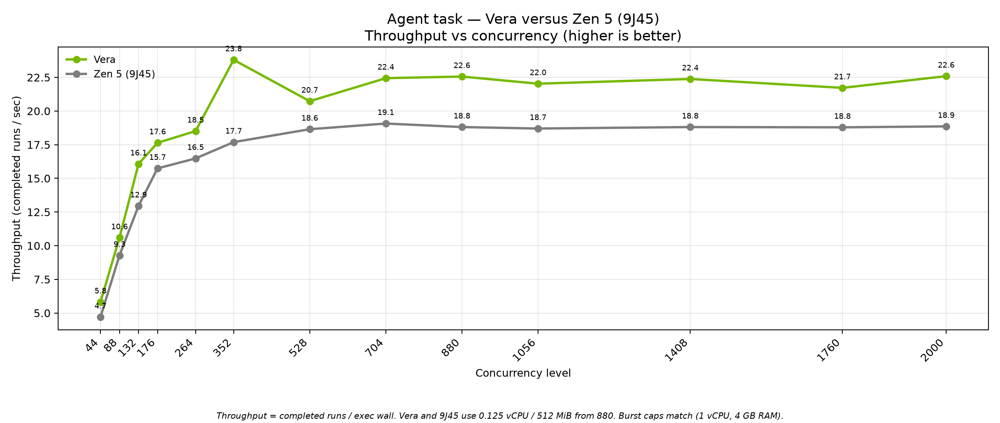
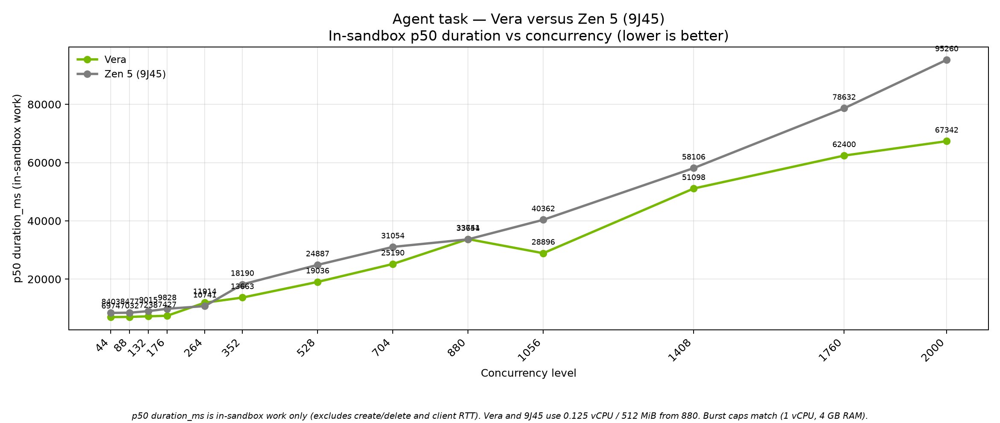

# Agent task: max-pack concurrency. Vera vs Zen 5 (9J45) vs Zen 5 (9575)

August 2026. Same workload, same seed. Matched concurrency rungs **44** through **2,000**.

Charts compare **Vera**, **Zen 5 (9J45)** (Phoenix), and **Zen 5 (9575)** through **2,000**.

## What to take away

On **Vera**, throughput stays near **~22 jobs/s** from 880 through 2,000. On **Zen 5 (9J45)**, the same 0.125 vCPU / 512 MiB packing stays near **~18.8 jobs/s**. On **Zen 5 (9575)**, throughput stays flat near **~6.8 jobs/s** on the smaller 128-thread box.

9J45 is the high core-count Zen 5 SKU. 9575 is the smaller box. Vera still packs more completed episodes per second at every rung.

Both Zen 5 series and Vera use the **same concurrency ladder** on the x-axis through **2,000**.





## How to read the charts

**Throughput (jobs per second)** is completed sandbox episodes divided by the wave's exec wall clock. Higher is better.

**p50 duration_ms** is the median time spent _inside_ the sandbox doing the agent loop. Lower is better.

## Fair comparison (why this is as matched as we can make it)

All three cells ran the **same agent task** (`repo-agent-v3`), **same snapshot** (`dtgraviet/vera-agent-benchmark:v3`), **same `--n 50`**, **seed 42**, **`-E 8`**, and **`--hold-then-exec`**. All three use the **identical concurrency ladder** from **44** through **2,000**:

```text
44  88  132  176  264  352  528  704  880  1056  1408  1760  2000
```

**At concurrency 44 through 704**, all three used the **same reserved capacity**: 0.125 vCPU and 1 GiB memory per sandbox. Burst caps are the same (1 vCPU, 4 GB RAM).

**From 880 onward**, **Vera** and **Zen 5 (9J45)** stay on **0.125 vCPU / 512 MiB**. **Zen 5 (9575)** uses smaller **guarantees** so a 128-thread box can pack **2,000** live sandboxes. **Burst caps are unchanged** on all three:

| | Vera | Zen 5 (9J45) | Zen 5 (9575) |
|--|------|--------------|---------------------|
| CPU guarantee | 0.125 vCPU | 0.125 vCPU | **0.025 vCPU** |
| CPU burst cap | 1 vCPU | 1 vCPU | 1 vCPU |
| Memory guarantee | 512 MiB | 512 MiB | 100 MiB |
| Memory burst cap | 4 GB | 4 GB | 4 GB |

**The 0.025 vCPU / 100 MiB guarantees on Zen 5 (9575) do not throttle in-sandbox performance.** They are **reservation / packing knobs** on the runner ledger so more sandboxes can stay live on a 128-thread box. Each sandbox still **bursts to a full 1 vCPU and up to 4 GB RAM** during the agent episode. With 0.125 vCPU that cell tops out around **~1,013** sandboxes. 9J45 does not need that trick. It packs 2,000 at the same 0.125 / 512 MiB shape as Vera.

## Configuration

| Setting | Reserved capacity (c=44..704) | Vera / 9J45 max-pack (c=880+) | Zen 5 (9575) max-pack (c=880+) |
|--------|------------------|------------------------|-------------------------|
| Target | vera / us-phoenix-1 / zen5-9575 | `--target vera` or `--target us-phoenix-1` | `--target zen5-9575` |
| CPU guarantee | **0.125** vCPU | **0.125** vCPU | **0.025** vCPU |
| CPU burst cap | **1.0** vCPU | **1.0** vCPU | **1.0** vCPU |
| Memory guarantee | **1 GiB** (default) | **512 MiB** | **100 MiB** |
| Memory burst cap | **4 GB** | **4 GB** | **4 GB** |
| Shared | `--n 50 --seed 42 -E 8 --hold-then-exec` · `dtgraviet/vera-agent-benchmark:v3` | same | same |

### Vera — two runs, matched ladder

**Step 1 — reserved capacity (1 GiB, c=44..704):**

```bash
UV_NO_SYNC=1 uv run main.py --benchmark agent --runner rlp --target vera \
  --snapshot dtgraviet/vera-agent-benchmark:v3 \
  --levels 44 88 132 176 264 352 528 704 \
  --n 50 --seed 42 -E 8 --hold-then-exec \
  --rlp-cpu 0.125 --rlp-cpu-max 1
```

**Step 2 — max-pack (512 MiB guarantee, c=880..2000):**

```bash
UV_NO_SYNC=1 uv run main.py --benchmark agent --runner rlp --target vera \
  --snapshot dtgraviet/vera-agent-benchmark:v3 \
  --levels 880 1056 1408 1760 2000 \
  --n 50 --seed 42 -E 8 --hold-then-exec \
  --rlp-cpu 0.125 --rlp-cpu-max 1 --rlp-memory 0.5 --rlp-memory-max 4
```

### Zen 5 (9J45) — two runs, matched ladder

**Step 1 — reserved capacity (1 GiB, c=44..704):**

```bash
UV_NO_SYNC=1 uv run main.py --benchmark agent --runner rlp --target us-phoenix-1 \
  --snapshot dtgraviet/vera-agent-benchmark:v3 \
  --levels 44 88 132 176 264 352 528 704 \
  --n 50 --seed 42 -E 8 --hold-then-exec \
  --rlp-cpu 0.125 --rlp-cpu-max 1
```

**Step 2 — max-pack (512 MiB guarantee, c=880..2000). Run from the Phoenix runner (`oc5002`), not a laptop:**

```bash
UV_NO_SYNC=1 uv run main.py --benchmark agent --runner rlp --target us-phoenix-1 \
  --snapshot dtgraviet/vera-agent-benchmark:v3 \
  --levels 880 1056 1408 1760 2000 \
  --n 50 --seed 42 -E 8 --hold-then-exec \
  --rlp-cpu 0.125 --rlp-cpu-max 1 --rlp-memory 0.5 --rlp-memory-max 4
```

### Zen 5 (9575) — two runs, matched ladder

**Step 1 — reserved capacity (1 GiB, c=44..704; same levels as Vera):**

```bash
UV_NO_SYNC=1 uv run main.py --benchmark agent --runner rlp --target zen5-9575 \
  --snapshot dtgraviet/vera-agent-benchmark:v3 \
  --levels 44 88 132 176 264 352 528 704 \
  --n 50 --seed 42 -E 8 --hold-then-exec \
  --rlp-cpu 0.125 --rlp-cpu-max 1
```

**Step 2 — max-pack (100 MiB guarantee, c=880..2000):**

```bash
UV_NO_SYNC=1 uv run main.py --benchmark agent --runner rlp --target zen5-9575 \
  --snapshot dtgraviet/vera-agent-benchmark:v3 \
  --levels 880 1056 1408 1760 2000 \
  --n 50 --seed 42 -E 8 --hold-then-exec \
  --rlp-cpu 0.025 --rlp-cpu-max 1 --rlp-memory 0.1 --rlp-memory-max 4 --rlp-disk 1
```

Runbook (Zen 5 (9575) cell prep): [`../tickets/redswitches-2k-maxpack-run.md`](../tickets/redswitches-2k-maxpack-run.md)

## Headline numbers (matched rungs)

**Through 704** = same reserved capacity on all three. **880–2,000** = max-pack.

| Concurrency | Vera p50 | 9J45 p50 | 9575 p50 | Vera tput | 9J45 tput | 9575 tput |
|------------:|---------:|---------:|---------:|----------:|----------:|----------:|
| 704 | 25,190 ms | 31,055 ms | 97,274 ms | 22.44 /s | 19.07 /s | 7.15 /s |
| 880 | 33,741 ms | 33,655 ms | 127,179 ms | 22.56 /s | 18.81 /s | 6.83 /s |
| 1,056 | 28,896 ms | 40,362 ms | 149,671 ms | 22.03 /s | 18.70 /s | 6.80 /s |
| 1,408 | 51,098 ms | 58,106 ms | 195,912 ms | 22.38 /s | 18.81 /s | 6.81 /s |
| 1,760 | 62,400 ms | 78,632 ms | 244,756 ms | 21.72 /s | 18.79 /s | 6.84 /s |
| 2,000 | 67,342 ms | 95,260 ms | 279,770 ms | 22.59 /s | 18.86 /s | 6.82 /s |

9J45 44–528 is the on-node 1 GiB rerun (`oc5002`). 704 and 880 are the matched 512 MiB glue file (`…125904`). 1056–2,000 stay on the on-node 512 MiB max-pack file (`…104841`). All zero failures.

## Method notes

- Charts merge Step 1 + Step 2 JSONL per series. Hide 9575: `uv run python scripts/nvidia_brief_maxpack_charts.py --no-9575`. Put it back: `uv run python scripts/nvidia_brief_maxpack_charts.py`.
- Base 704 narrative: [`../nvidia-agent-brief-704-zen5/`](../nvidia-agent-brief-704-zen5/)
- Sources: [`sources.md`](sources.md) · Inventory: [`maxpack-data-inventory.md`](maxpack-data-inventory.md)
