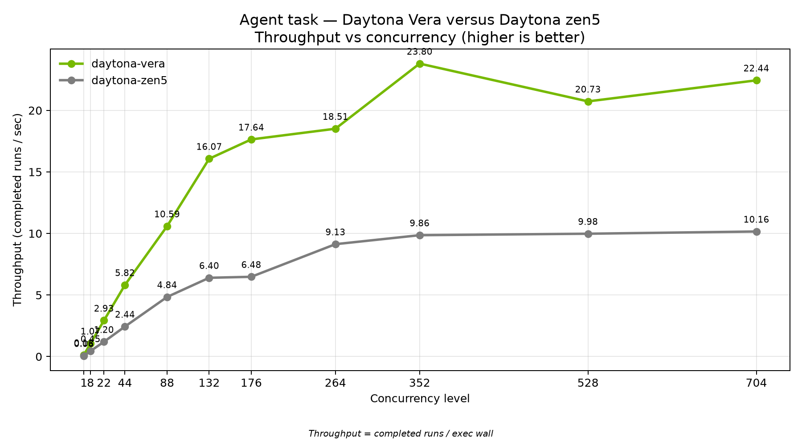
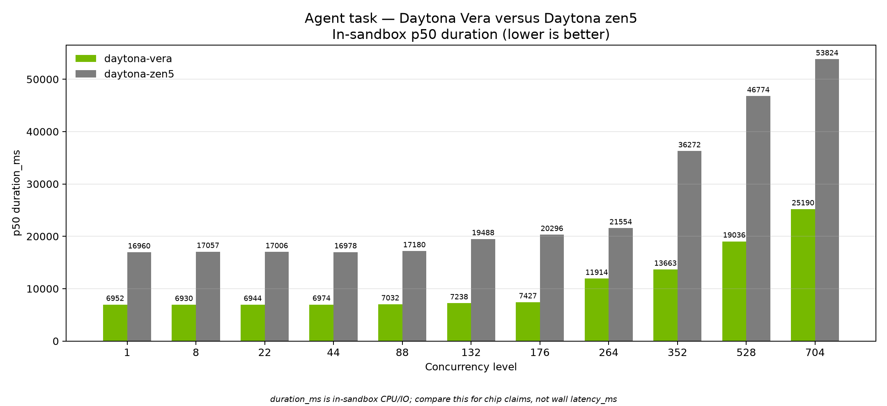

# Agent task: Daytona Vera versus Daytona zen5

August 2026. Coding-agent sandbox results on NVIDIA Vera and AMD EPYC Zen 5 (Phoenix).

This brief covers one workload: the **agent task** Daytona uses to stand in for coding-agent sessions inside isolated sandboxes. Both chips ran the same image, the same seed, and the same concurrency ladder.

## What to take away

On a single sandbox, Vera finished the agent loop in about **7.0 seconds** median. Zen5 took about **17.0 seconds**. That is roughly **2.4× faster** in-sandbox time on Vera.

As concurrency climbs, Vera keeps packing more completed jobs per second. Throughput reaches about **23.8 jobs/s** at 352 concurrent sandboxes, while Zen5 plateaus near **10 jobs/s**. In-sandbox median time stays shorter on Vera at every level we measured.





## The agent task

Daytona customers run coding agents inside sandboxes: open a project, search the tree, read and parse code, edit files, then verify with tests. This agent task mirrors that loop without calling an LLM and without leaving the sandbox.

Each episode:

1. **Seeds** a multi-file Python package with deliberate bugs and a large generated module tree.
2. **Searches** the workspace for symbols and call sites (the same kind of repo walk a coding agent does).
3. **Parses** modules with the AST so the work is real Python analysis, not a toy loop.
4. **Applies** deterministic patches that repair the seeded bugs.
5. **Runs a heavy pytest suite** (parametrized CPU-burning cases) so most of the wall time is in-sandbox compute and filesystem I/O—the same cost profile we see when agents edit and re-test code in Daytona.

Successful episodes return a matching checksum on both chips, so Vera and Zen5 completed the same work.

## How to read the charts

**Throughput (jobs per second)** is completed sandbox episodes divided by the wave’s exec wall clock. Higher is better. It answers: how many isolated agent sessions can the platform finish per second as we pack the machine?

**p50 duration_ms** is the median time spent *inside* the sandbox doing the agent loop. It excludes sandbox create, delete, and client network. Lower is better. It is the chip-facing metric for “how long does one agent episode take?”

## Configuration

| Setting | Value |
|--------|--------|
| Workload | Agent coding loop (`repo-agent-v3`) |
| Snapshot | `dtgraviet/vera-agent-benchmark:v3` (multi-arch amd64 + arm64) |
| Scale factor `--n` | **50** (calibrated for multi-second idle work) |
| Seed | **42** |
| Episodes per sandbox (`-E`) | **8** |
| Concurrency ladder | 1, 8, 22, 44, 88, 132, 176, 264, 352, 528, 704 |
| Fleet mode | Hold-then-exec (create the wave, then run all episodes) |
| CPU guarantee | **0.125** vCPU per sandbox |
| CPU burst ceiling | **1.0** vCPU (`--rlp-cpu-max 1`) |
| Memory / disk defaults | 1 GiB memory, 2 GiB disk |
| Vera cell | On-node client next to the Vera RLP runner (`aarch64`) |
| Zen5 cell | Phoenix (`us-phoenix-1`, AMD EPYC / `x86_64`) |

Matched recipe on both sides:

```bash
UV_NO_SYNC=1 uv run main.py --benchmark agent --runner rlp \
  --snapshot dtgraviet/vera-agent-benchmark:v3 \
  --levels 1 8 22 44 88 132 176 264 352 528 704 \
  --n 50 --seed 42 -E 8 --hold-then-exec \
  --rlp-cpu 0.125 --rlp-cpu-max 1
```

Vera used `--target vera`. Zen5 used `--target us-phoenix-1`.

The **0.125 / max 1** CPU settings let both cells pack far past a hard 1-vCPU-per-sandbox reservation, so the high concurrency rungs (352–704) are a fair density compare rather than an artificial capacity cliff on either side.

## Headline numbers

| Concurrency | Vera p50 duration | Zen5 p50 duration | Vera throughput | Zen5 throughput |
|------------:|------------------:|------------------:|----------------:|----------------:|
| 1 | 6,952 ms | 16,960 ms | 0.13 /s | 0.06 /s |
| 88 | 7,032 ms | 17,180 ms | 10.59 /s | 4.84 /s |
| 176 | 7,427 ms | 20,296 ms | 17.64 /s | 6.48 /s |
| 352 | 13,663 ms | 36,272 ms | 23.80 /s | 9.86 /s |
| 704 | 25,190 ms | 53,824 ms | 22.44 /s | 10.16 /s |

Vera finished with **zero failed jobs** through 704. Zen5 finished with **zero failed jobs** through 528 and **one** failed job at 704.

## Method notes

- Duration figures are median in-sandbox `duration_ms`. Throughput uses completed runs over measured exec wall.
- Both series use the same snapshot tag, seed, `--n`, episode count, and concurrency ladder.
- Each cell is one machine. Absolute packing at the top of the ladder also reflects how many sandboxes that cell can keep live; prefer duration for chip claims and throughput for packing.
- Charts in this brief: `eda_output/nvidia-brief-agent/`.
- Source JSONL:
  - Vera: `data/agent/rlp-vera-c0p125-max1/concurrency_20260826_005637_n50.jsonl`
  - Zen5: `data/agent/rlp-phoenix-c0p125-max1/concurrency_20260826_012143_n50.jsonl`
